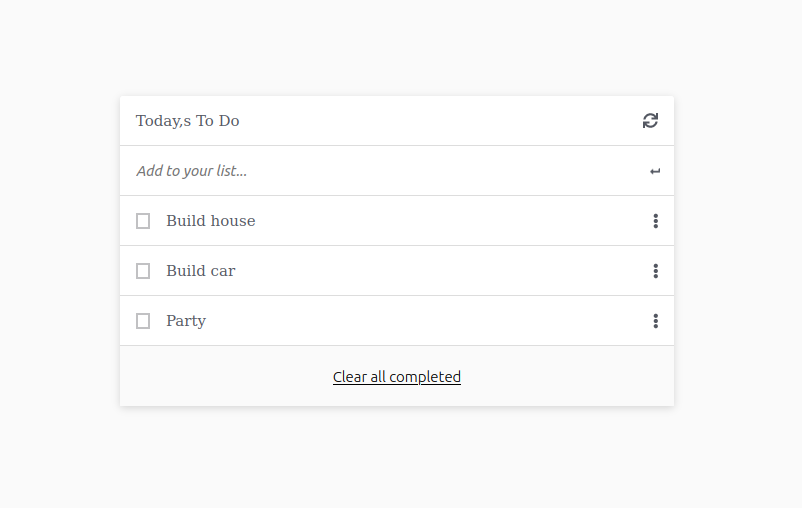

# Todo List

> This is a minimal yet powerful to-do list.

The application has functionality to add, remove, mark as completed, and reorder todo item.

## Built With

- HTML
- CSS
- Javascript

## Live Demo

- [Demo](https://afizsavage.github.io/todo-list/)

## Getting Started

To get a local copy up and running follow these simple example steps.

### Setup

1.  Open a terminal, navigate to the directory that you would like to clone the repository into using commands like:

    - `cd /pathname` to change your working directory.

2.  Next, clone the remote repository and create a local copy on your machine using this command:

    - `git clone https://github.com/afizsavage/todo-list`

3.  Now you can see the contents of the remote repository on your machine by moving into the newly cloned directory:

    - `todo-list`
    - `ls -la`

4.  run `npm install` on the command line to download all dependency packages.

### Run

1. run `npm run build` to build the static `dist` folder.

2. run `npm start` to serve the static folder with webpack-dev-server.

3. webpack-dev-server will automatically open `http://localhost:8080/` in your default browser.

## Author

👤 **Afiz Savage**

- GitHub: [@afizsavage](https://github.com/afizsavage)
- Twitter: [@fizzo_geek](https://twitter.com/fizzo_geek)
- LinkedIn: [@afiz-savage](https://www.linkedin.com/in/afiz-savage-3b91a21ba/)

## Show your support

Give a ⭐️ if you like this project!
